# CheckBus
CheckBus es el demo de un aplicación, que nació a partir de un proceso de UX-research enfocado en User-centered design (UCD); cuya finalidad es calificar y poder hacer reclamos sobre el servicio brindado por las empresas de buses.

## Desarrollado para
[Laboratoria](http://laboratoria.la)
***
## ver más detalles

* **TRACK:** _ESPECIALIZACIÓN UX-DESIGNER_
* **CURSO:** _PRIMER PROYECTO DE UX_
* **UNIDAD 1:** _MI PRIMER PROYECTO UX_

***
## Equipo de trabajo

+ Ortiz Villafuerte, María Cristina.
+ Cisneros Torre, Yelitza.
+ Colqui Santos, L. Vanessa.
+ Cervera Huamaní, Darcy.
+ Siesquén Sánchez, Molly.
+ Valverde Mejía, Longhi.

***

## Descripción del reto

  Catalina una emprendedora viajera. Durante sus últimas vacaciones  estuvo viajando por todo latinoamérica. Durante estos viajes  tuvo que tomar muchos buses de todo tipo para llegar a ver los paisajes más lindos del continente. Durante sus viajes  se dio cuenta que existen aún muchas oportunidades para mejorar la experiencia de todos los usuarios de este tipo de transporte: horarios, embarques, desembarques, compra de tickets en los terminales, compra de tickets online, cancelaciones, cambios de pasajes, etc. Adicionalmente, se dio cuenta que todas las plataformas de venta de tickets de bus tienen cosas por mejorar en Chile, Perú y México.

***

## Objetivo

 Investigar más sobre los usuarios de este tipo de transporte; definir y probar un MVP.

 ***

 ## Desarrollo

 - Para la resolución del reto seguimos las estapas de DCU(Diseño Centrado en el Usuario).
 - Para la organización y planificación usamos la herramienta Trello,  [Nueva Experiencia en Empresa de Buses Trello](https://trello.com/b/mylfEcsR/retonueva-experiencia-en-empresas-de-buses).

 ## Etapas DCU (Diseño Centrado en el Usuario):

 ## A. Descubrimiento e Investigación

   ### Actividades:

   #### 1.- Formulación de las preguntas para la entrevista con usuarios y la encuesta online

   - A través de la herramienta: lluvia de ideas, logramos definir las preguntas para la entrevista; teniendo en consideración el objetivo identificado.
   [Preguntas para la entrevista con usuarios:](assets/documents/entrevista/ENTREVISTA-EMPRESA-BUSES.docx).
   [Preguntas para la encuesta online con usuarios:](https://docs.google.com/forms/d/1vt41tvkkN4uOYlEV_CwwjGsl9o1aFtyVo3kdzdL1qKo/viewform?edit_requested=true).

   #### 2.- Entrevista con usuarios (Plaza Norte y Javier Prado)

   - Recolección de datos presencial.

   - Terminal Terrestre Plaza Norte (8:30 am, martes 30 de enero): Se realizaron 12 entrevistas. Al término de las entrevistas nos solicitaron un permiso para tomar fotos, entrevistar u otra actividad dentro de la institución.

   .
   .

  - Agencias de buses Javier Prado (9:30 am, martes 30 de enero): Se realizaron 11 entrevistas.

   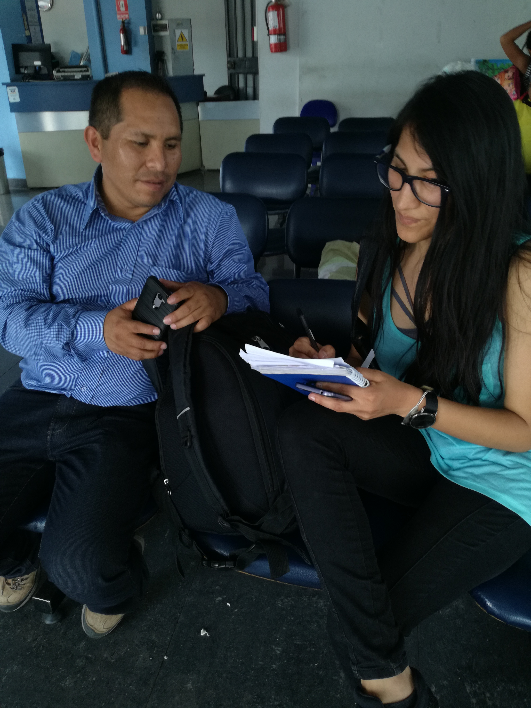.
   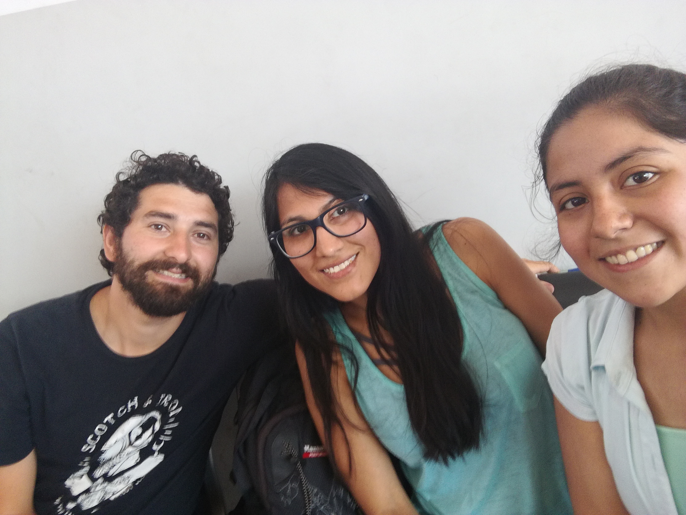.

   #### 3.- Encuesta online a través de Google Drive

   - Recolección de datos online, a través de publicaciones en el facebook, correo electrónico, etc. Se obtuvo 36 respuestas.

   .
   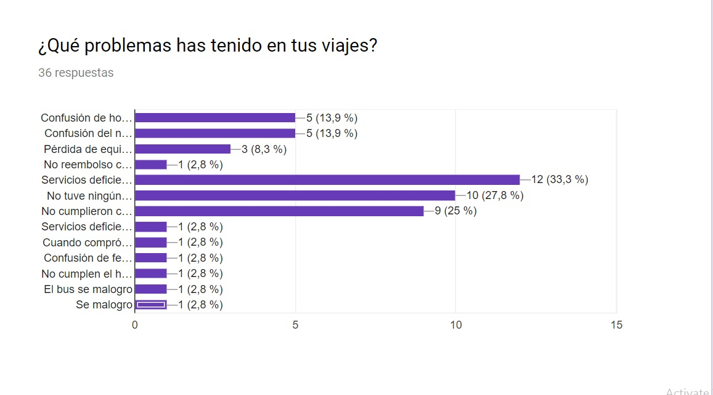.
   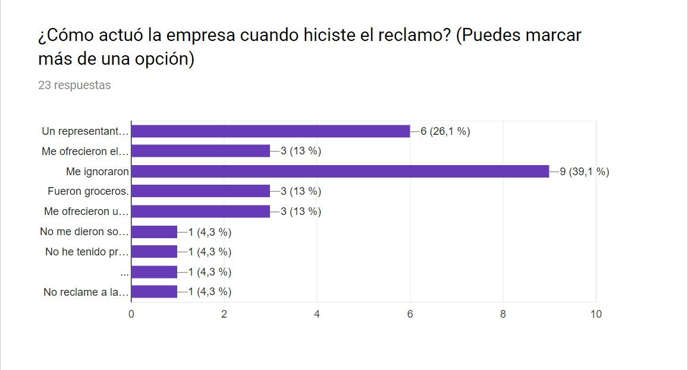.

   #### 4.- Investigación por internet ( web de empresas de buses, agencia de venta de pasajes, encuestas o estudios anteriores, foros, facebook, apps, etc)

   - Se identificaron los temas a investigar en internet: plataformas online, todo sobre las empresas de buses, etc.
   [Plataformas online de servicios de empresas de transporte](assets/documents/investigación/Plataforma-web-empresas.pptx).
   [Calificaciones de apps de empresas de transporte](assets/documents/investigación/Calificaciones_de_apps_de_agencias.xlsx).

 ## B. Síntesis y Definición

   ### Actividades:

   #### 1.- Definición del problema: Diagrama de afinidad.

   Se utilizó el diagrama de afinidad, a través los siguientes pasos:
   - Paso 1.- En posits se colocó los comentarios( cosas que no les gusta, cosas que desearían, quejas, cosas que no quedaron claras, etc) tal cual como los usuarios lo mencionaron sin interpretaciones ni deducciones; dichos usuarios fueron de las entrevistas personales que se hicieron en la terminal terrestre Plaza norte y las agencias en Javier Prado.

   .

   - Paso 2.-  Se agrupó  los posits por temas. El fin de esta actividad fue organizar lo recolectado para tener cosas claras y especificas  agrupadas en temas. Los temas que surgieron fueron: Precios/formas de pago, online, atención al cliente, presencial, horarios, ok sin quejas, raros, frecuencia de viajes, servicios dentro del bus.

   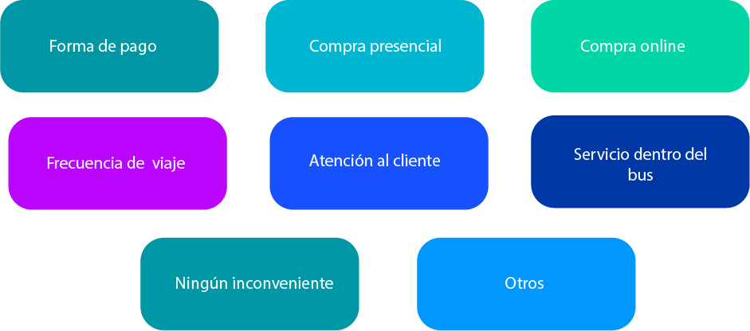.
   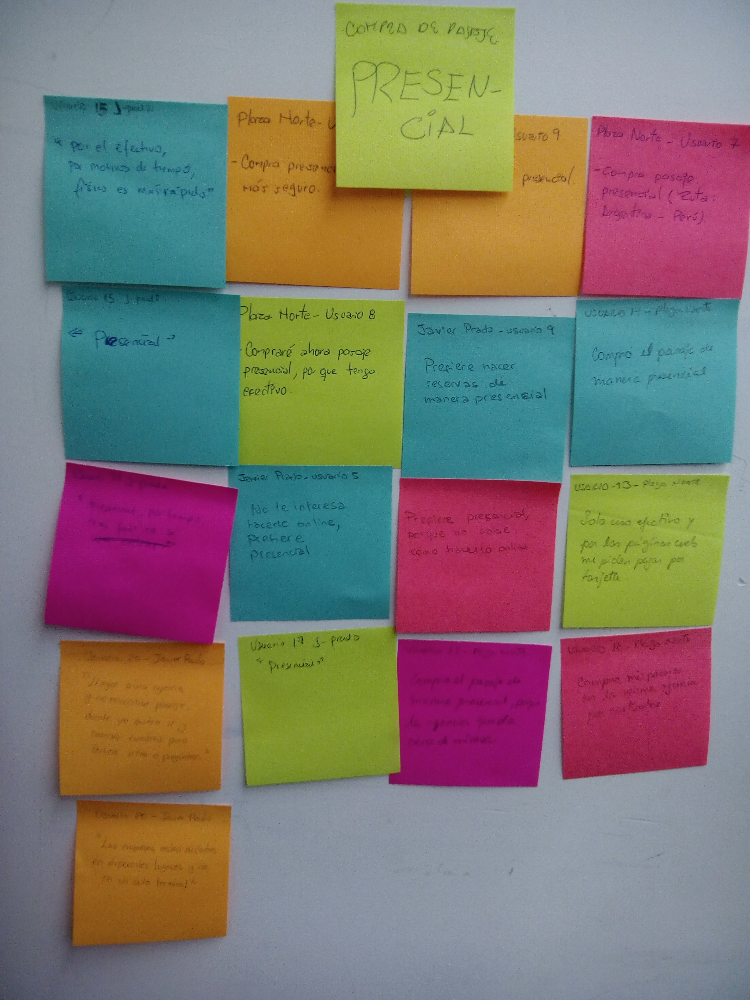.

   #### 2.- Priorizar a partir de los temas determinados en el diagrama de afinidad.

   - Para esta actividad se hizo una lluvia de ideas y se tomó en cuenta los resultados de las encuestas.

   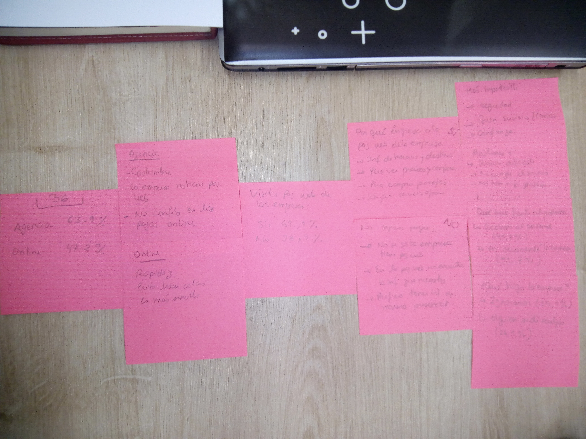.

   - Priorizamos los temas "Servicios dentro del bus" porque existían más usuarios con los mismos inconvenientes. Se priorizó también el tema "atención al cliente" porque si un servicio dentro del bus no es satisfactorio, el pasajero reclama y es necesario que dicha queja se atiendan de manera adecuada; de ahí la importancia de la relación entre los dos temas.

   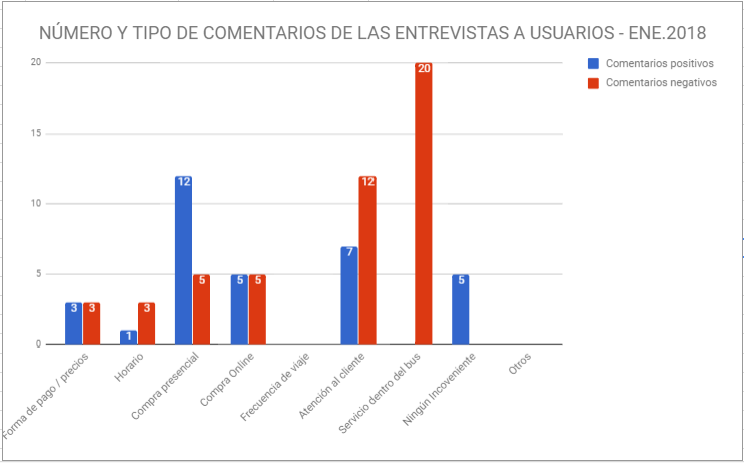.

  #### 3.-  Journey-map del problema encontrado.

  Esta herramienta nos ayudó a definir las experiencias positivas y negativas por las que pasan los usurios, mientras realizan las acciones identificadas en el problema. De esta manera podemos definir los momentos en los que debemos reforzar las emociones positivas y mejorar las experiencias negativas.

  .

   #### 4.- Elección el problema que se abordará.

   - El problema que se encontró es sobre: "No cumplimiento de los servicios que ofrecen dentro del bus y mala atención al hacer un reclamo".

   - ¿Porque? Deacuerdo a los temas elegidos en la actividad de priorización se entendió que los servicios dentro del bus que ofrecen las empresas (Asientos, calefacción, ventilación, limpieza, comida, atención de terramoza, etc) muchas veces no son ciertas o no se cumplen por completo; además cuando ocurre un reclamo estos no son atendidos, o medianamente atendidos dejando a los pasajeros insatisfechos.

   #### 5.- Benchmarking.

   Se realizó el benchmarking con las 7 principales empresas de tranportes del país. Para así conocer y comparar los servicios que ofrecen a los pasajeros.

   1. Transportes Cruz del Sur S.A.C

   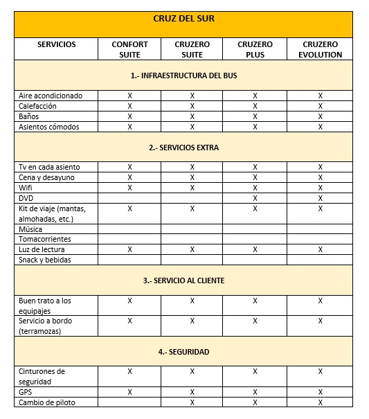.

   2. Turismo Civa S.A.C

   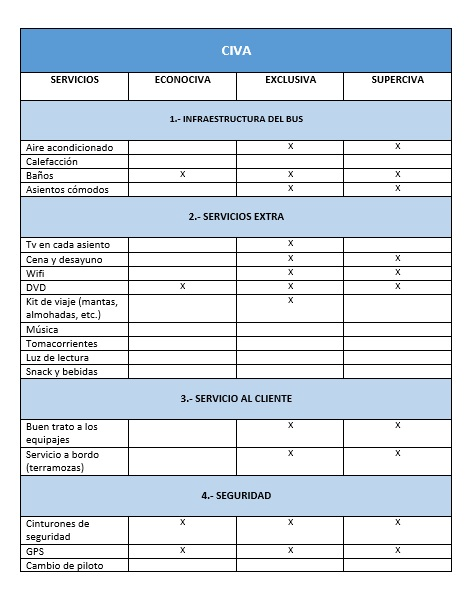.

   3. Empresa de Transportes Flores Hermanos S.C.R.LTDA.

   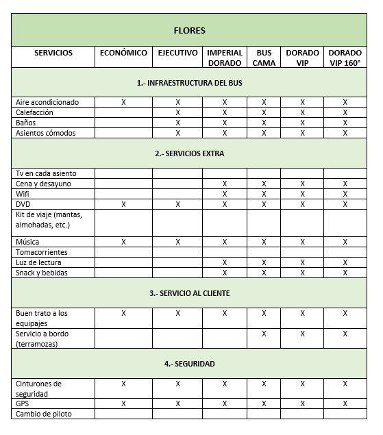.

   4. Movil Bus S.A.C

   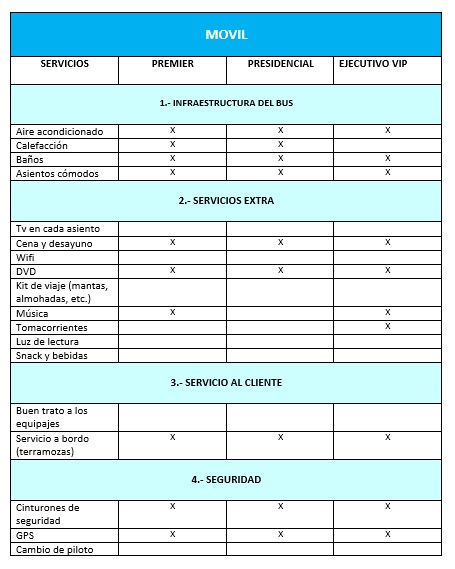.

   5. Oltursa

   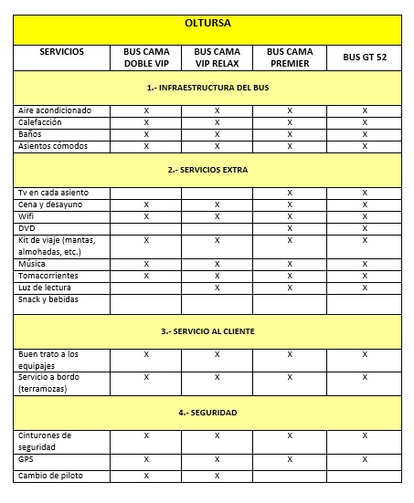.

   6. Tepsa

   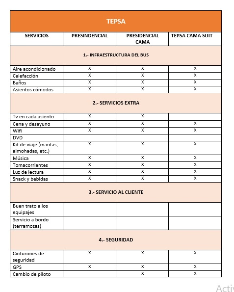.

   7. Transportes Línea S.A

   .

   #### 6.- Definición de los User personas.

   - Se definió a nuestro user person primario y secundario,  Ana María Rojas y José Carlos respectivamente.

   - Se recopiló en  clase algunos aspectos de nuestro user person primario.Esto se basó en las opiniones, motivaciones, quejas, necesidades de los usuarios en la entrevista personal, encuesta online; relacionados al problemas que obtuvimos "No cumplimiento de los servicios que ofrecen dentro del bus y mala atención al hacer un reclamo".

   - Aplicar esta herramienta nos permitió resumir necesidades, motivaciones, expectativas comunes en un solo ejemplo (user person), nos brindó una visión general de como son nuestros usuarios individualmente;  y poder inferir (empatizando) como este podría usar nuestro producto, para asi poder identificar con facilidad sus necesidades y la razon por la cual surge esa necesidad(Problems Statements).

   **User Persona**

   .

   **User Secundario**
  - Aplicar esta herramienta nos permitió resumir necesidades, motivaciones, expectativas comunes de un usuario secundario. Representa a la persona que usaría algunas funcionalidades de nuestro producto.

   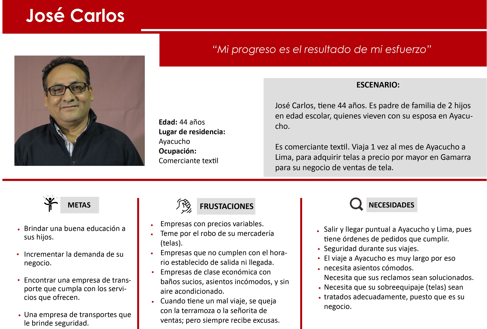.

   #### 7.- Definición de los Problems Statements.

   - Se definió los problems statements en base a las necesidades de nuestros user persons (primario y secundario). se usó el modelo:

        -  " ANA NECESITA {necesidad} PORQUE/PARA {insight}".

   - Esta actividad nos ayuda más a centrarnos en los resultados que en el producto, ya que esta lista  de las necesidades de Ana y el motivo de sus necesidades, nos permite ir viendo formas de resolver ( HMW) específicamente cada necesidad punto por punto.

   - Lista de los Problems stataments identificados:

       - **Ana María necesita** puntualidad en la salida y llegada del bus,**porque** es un valor que aprecia mucho; principalmente porque tiene niños pequeños.
       - **Ana María necesita** un conductor de confianza, **para** la seguridad de ella y sus hijos.
       - **Ana María necesita** asientos limpios, **para** viajar relajada.
       - **Ana María necesita** cinturones de seguridad en buenas condiciones, **porque** necesita viajar segura con sus hijos.
       - **Ana María necesita** tener certeza que el bus cumplirá con su hora de llegada al terminal, **para** evitar que su hijo se aburra demasiado con la espera.
       - **Ana María necesita** aire acondicionado y calefacción, **porque** viaja a zonas frías y tropicales con su familia.
       - **Ana María necesita** una plataforma donde su calificación/opinión sobre la empresa no sea borrada, **para** confiar en que la empresa implementará una solución.
       - **Ana María necesita** buen trato del personal de la empresa (terramozas), **porque** el trato amable es lo que más aprecia de un servicio.
       - **Ana María necesita** desayunos, almuerzos y cenas adecuados, **porque** viaja durante muchas horas.
       - **Ana María necesita** tener seguridad de que su equipaje llegará bien, **porque** lleva víveres para su familia.
       - **Ana María necesita** una plataforma segura donde poner sus reclamos,**para** sentirse escuchada y resolver sus problemas.
       - **Ana María necesita** wifi cuando viaja, **para** que su hijo no se aburran.
       - **Ana María necesita** un sistema que le asegure los verdaderos servicios que brinda la empresa, **para** poder elegir donde viajar.
       - **Ana María necesita** buena atención al subir al bus, **porque** viaja más de 8 horas a una zona calurosa.
       - **Ana María necesita** que el bus tenga aire acondicionado, **porque** realiza viajes largos al interior del país, con sus hijos.
       - **Ana María necesita** asientos cómodos

   #### 8.- Definición de lo HMW( Howgit      Might We?).

  - Se definió los HMW donde  se planteó preguntas tomando como base los PROBLEMS STATEMENTS  ya elaborados en la actividad anterior. se siguió  siguiendo el modelo **¿Cómo podríamos hacer X cosa?**.

  -  Para poder Formular o definir estas preguntas tuvimos que tener ciertas consideraciones:
    - Estas preguntas deben ser positivas
    - No ser tan generales ni tan especificas (ejm. ¿ Que pasos podríamos seguir para hacer esto o aquello), pues se debe evitar hacer preguntas que nos lleven a tener respuestas  muy especificas.

  - Definir lo HMW nos permitó entender mejor las necesidades especificas, reales e ir pensando en algunas formas de solucionarlo.

   - ver lista de HMW:

       - ¿Cómo podríamos entretener a los hijos de Ana María?
       - ¿Cómo podríamos verificar los servicios brindados, a través de las experiencias de los usuarios?
       - ¿Cómo hacer que el usuario sienta confianza al momento de elegir una empresa para viajar?
       - ¿Cómo podríamos ofrecer un buen servicio de wifi dentro del bus?
       - ¿Cómo podríamos darle garantía al usuario sobre el servicio adquirido?
       - ¿Cómo podríamos mejorar la atención a los reclamos de los pasajeros?
       - ¿Cómo podríamos brindar aire acondicionado y calefacción?
       - ¿Cómo podríamos hacer que la experiencia del viaje sea más segura?
       - ¿Cómo podríamos hacer que los reclamos sean escuchados y atendidos?
       - ¿Cómo podríamos adaptar el espacio del bus, para que Ana se sienta segura con su equipaje?
       - ¿Cómo podríamos hacer que las terramozas tengan un trato amable con los pasajeros?    
       - ¿Cómo podríamos hacer el viaje más cómodo?
       - ¿Cómo podríamos asegurar que los equipajes no se extravíen o dañen?

   #### 9.- Definición de los WHAT IF?

   - En base a los HMW (Cómo podríamos hacer "x" cosa) definimos los WHAT IF? (¿que tal si?) que nos permitieron encontrar algunas soluciones a situaciones especificas.

  - Para formular estos "what if?" tomamos en cuenta ciertos guías:
     - Agregar o eliminar alguna parte de la experiencia
     - Agregar un nuevo actor.
     - Tomar ideas de otras industrias.

  - Aplicar esta herramienta nos permitio, filtrar aun más necesidades reales, aquí ya encontramos algun actores que interfieren el servició, descartamos necesidades no tan relevantes, es decir, que no afectan de sobremanera la comodidad del user person (Ana María). Nos permitió también inferir algunas soluciones a las necesidades.

  - Lista de los WHAT IF?:

       - **What if** ¿Las terramozas  enseñan o indican la seguridad dentro del bus?
       - **What if** ¿Hay un registro del servicio de las terramozas?
       - **What if** ¿Hay un mago en el bus?
       - **What if** ¿Hay un servicio personalizado para madres con noños de 0 a 5 años?
       - **What if** ¿El usuario pudiera programar la cena/comida que quiere recibir?
       - **What if** ¿El usuario pudiera calificar el servicio brindado?
       - **What if** ¿Viajar dentro del bus sea divertido, poniendo calificaciones dentro del bus?
       - **What if** ¿La empresa te envía un mensaje 30 minutos antes de que salga el bus?
       - **What if** ¿Hay un especialista en reclamos dentro del bus?
       - **What if** ¿El usuario pudiera programar los servicios que quiere recibir de acuerdo al precio a pagar?
       - **What if** ¿Hay un personal encargado de verificar la limpieza dentro del bus?
       - **What if** ¿Aplicamos las funcionalidades de Fitco?
       - **What if** ¿Qué tal si usamos las funcionalidades de Trivago?

   #### 10.- Definición de FEATURE LIST.

   ##### Plataforma de calificación del usuario.

  - **Perfil del usuario**
    - Registro de sesión con Facebook
    - Registro de sesión con Google
    - Registro de sesión con su email

  - **Sistema de calificación del servicio**
    - Notificación automática.
    - Opción de anonimato.
    - Opción de brindar una opinión.
    - Generación del enlace con la empresa para la solución del reclamo.

 ## C. Ideación

   ### Actividades:

   #### 1.- Realización de un Story board.

   Partiendo de nuestro user persona, creamos un storyboard, con los momentos que tiene el usuario a lo largo de su proceso de toma de desiciones respecto a su necesidad de encontrar una empresa de bus que cumpla con los servicios que ofrece y poder tener un viaje cómodo junto con su hijo.

   Así como también a tener más claro hacia dónde queremos llevar el diseño de nuestro producto y poder resolver de la manera más óptima la necesidad de nuestro usuario a cubrir.

   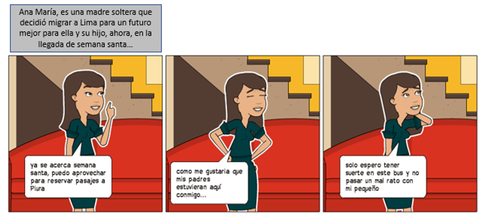
   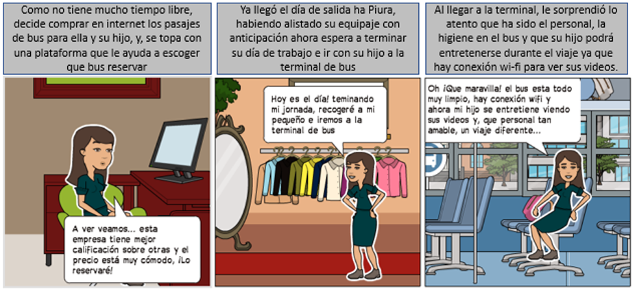

 ## D. Prototipado

  ### Actividades:

  #### 1.- Realización del Prototype Content(02/02/2018 y 05/02/2018).

  - Se realizó el prototype content de nuestro MVP.

  - Para realizarlo nos guíamos del artículo [Las damas, los niños y el contenido primero](https://medium.com/mercadolibre-ux/ux-empieza-por-contar-una-historia-26f23d27a63e).

  - Esta técnica es una versión temprana y esquemática de la conversación que el usuario tiene con el producto, cuyo soporte es el texto. Realizar aquello nos permitió hacer foco de la estructura que tendrá nuestro producto (tener claro donde empezará y terminará el flujo de nuestro producto); ademas,nos permitió ver las fricciones a eliminar, lo que debemos simplificar en la interacción y los lugares en los que tenemos una oportunidad de deleitar al usuario. Para tener estos beneficios el prototype content se testeó (ver feedback en la etapa de E.- Actividades de testing).

  - Archivo del prototype content: https://docs.google.com/document/d/1Bdj6_rydMJWmwMQ-s1xbYqpjYtaZO5bo0jFTCYBNoxc/edit?usp=sharing

  #### 2.- Realización del Paper Prototyping versión-1 & Testing(06/02/2018).

  - Sé hizo un prototipo inicial en papel de nuestro MVP.

  - Nos basamos en el flujo que se hizo en el prototype content y story board. Cada integrante prototipó en papel una parte del flujo para luego unirlo y tener un prototipo inicial para testearlo.

   
   
   

  - El hacer el prototipo inicial en papel nos permitió tener una interfaz de baja fidelidad, económico que nos ayudó a verificar si los usuarios son capaces de realizar sus tareas (identificar claramente los componentes que le llevara a entender una funcionalidad; y una navegación clara) con la interfaz propuesta, ver las dificultades que tiene, que cosas no le gusta; y de esta manera,sin más costo, cambiar dichos requerimientos, observaciones o recomendaciones y volver a testearla hasta tener una interfaz entendible y satisfactorio para el usuario antes de mandarlo al diseño de un interfaz de alta fidelidad.

  #### 3.- Realización del Paper Prototyping versión-2 & Testing(06/02/2018).

  - Sé iteró deacuerdo al feedback del primer testeo que se realizó con 3 usuarios dentro de clase. Se obtuvo un prototipo en papel versión-2.

  - Las modificaciones fueron:

  - En la primera vista (registro) se redistribuyó el contenido(abarcaba mucha información)para que sea más sencillo de entender. Esto implicó crear un modal nuevo para que contenga las diferentes formas de registrarse.

 - En la vista perfil, la parte donde muestra calificaciones pendientes se acomodó en el la parte superior tal que el usuario sea lo primero que vea para que pueda calificar.

 - El contacto con la empresa se enviará al correo personal.

 - Se quitarón botones "continuar" que eran innecesarios.
 - Se creó una ventana donde al hacer un reclamo se genera un código como garantia de que se hizo el reclamo.

 
 
 
 

  #### 4.- Realización del Paper Prototyping - final & Testing(06/02/2018).

  - Sé iteró deacuerdo al feedback del segundo testeo que se realizó con usuarios dentro de clase. Se obtuvo un prototipo en papel versión-final (MVP-final).

  - ver prototipo: link

 ## E. Testing

  ### Actividades:

  **I.- Testing del Prototype Content**

   Se hizo testing del Prototype Content con las compañeras de clase. La finalidad: obtener feedback para mejorar el flujo de nuestro producto antes de realizar el prototipado del MVP.

  1.- Entrevistas a 3 usuarios dentro de clase.    
  2.- El proceso consistió en explicar 1 a 1 el Content Prototype. con un tiempo de 15minutos por usuario.     
  3.- Después de recibir feedback se procedió a mejorar el Content Prototype.     
  4.- Finalmente pasamos a prototipar nuestras vistas.

  Se obtuvo los sgtes. Feedback's:

  **Testing 01:**

    * No entiendo, ¿qué hace la app?. ¿Es sólo para calificar el servicio de bus?.
    * Sí calificaría cada item, aunque sea largo.
    * Las primeras preguntas de adónde viajo o con qué empresa, para qué me sirven.

  **Testing 02:**

    * El logueo es con DNI o Ticket de Viaje.
    * Si el usuario marca La mayoría en negativo/positivo cómo miden eso para dar el mensaje positivo/negativo. Ejemplo (3 a 1)
    * Calificar en uno sólo todos los servicios.

  **Testing 03:**

    * Al hacer la encuesta de satisfacción, hacer una escala de satisfacción de "nada bueno" a "muy bueno".
    * La encuesta es muy larga.
    * Se necesitaría crear dos aplicaciones, una para el usuario y otra para la empresa.
    * En dónde guarda los datos que el usuario ya ha viajado.

  **Resultado final del Prototype Content**

  [Content Prototyping](https://docs.google.com/document/d/1Bdj6_rydMJWmwMQ-s1xbYqpjYtaZO5bo0jFTCYBNoxc/edit)

  **II.- Testing de Paper Prototype**

Después de un arduo proceso de Creación del Producto pasando por todas las etapas(descubrimiento e investigación, síntesis y definición, ideación, prototipado, testing). Se realizó un testing con 03 usuarios, con el fin de obtener feedback del producto creado y mejorar a través del tiempo.

1.- Luego del testing con el Protype Content, se realizaron las pruebas con el Prototype del Producto en clase.  
2.- En clase luego de varias horas de trabajo en el Prototype, se empezó a testear con 03 usuarios reales. Realizándose una previa entrevista y finalmente el proceso del testing[Se usó como base la "[Guía de usabilidad](https://docs.google.com/document/d/14IuWyDjKf7YbrObpoxhQxWEAqTISbaRvY6XF5NHZooQ/edit)" y "[Consentimiento](https://docs.google.com/document/d/11Op9jpjyub1_QO0LnH8LdwJTyJfu2daT52cEfFISueA/edit)"].  
3.- Finalmente se obtuvo un feedback de los 03 usuarios testeados y comenzamos a iterar.   

**María Teresa:**

    * Que tenga menos ventanas.
    * Que haya una garantía de respuesta al reclamo.
    * Que genere un código de reclamo para darle más seriedad.
    * Que la comunicación con la empresa sea via correo o llamada

**Gonzalo:**

    * En la vista registró mejor distribución del contenido, tiene mucha información que distrae.
    * Que el contacto con la empresa sea via el correo personal.
    * En lugar de una app, también podría ser una página web.
    * Mayor rapidez en el flujo, sin tantos botones de "continuar"

**Ruth:**

    * El contacto con la empresa, a través del correo personal.
    * La vista de registro tiene mucha información para una vista mobile, simplificarlo. Las opciones de registro que vaya en otra vista o un modal.
    * En la vista perfil, las calificaciones pendientes no son notorias a simple vista, ubicarlo en un lugar donde se pueda visualizar rápidamente.

  ##  Presentación final

    [Presentación final](https://docs.google.com/presentation/d/1LnBKM7p9mY5F7B61CuI288OElfx6fKXQlF8CRVNpjdo/edit?ts=5a7a3a6d#slide=id.g30df108ca2_1_30)    

  ## Conclusiones

    - La importancia de realizar una buena investigación y descubrimiento de las necesidades/problemas de los usuarios, a través de las diferentes herramientas, nos brindó la base sólida de nuestro proyecto, facilitándonos continuar con las diferentes etapas.

    - A mayor feedback recibido por diferentes usuarios a nuestro paper prototyping, durante el testing; las versiones del prototipo se ajustaron a mejorar la experiencia del usuario, e indican en un futuro mayor aceptación y éxito de nuestro producto.

    - La presentación del producto al público debe ofrecer una rápida, comprensible y sencilla solución a las necesidades/problemas identificados; antecedida de una breve narración de las etapas que nos conducieron al producto final, para atraer a los futuros usuarios y potenciales inversionistas.

 ## **ETAPAS POSTERIORES  AL PROTOTIPADO EN PAPEL (MVP)**

### A.- **SÍNTESIS**

#### 1.- **User Persona Negative**

- Se definió a nuestro user persona negativa: Steve.
- Aplicar esta herramienta nos permitió resumir necesidades, motivaciones, expectativas comunes de un usuario negativo. Representa a la que persona que no usaría nuestro producto; y asi descartar ciertos servicios que no serían necesarios en nuestro MVP.

.

#### 2.- **Journey-map del producto**.

Esta herramienta nos ayuda a definir las experiencias positivas y negativas por las que pasan los usurios, mientras realizan el flujo principal de nuestro producto. De esta manera podemos definir los momentos en los que debemos reforzar las emociones positivas y mejorar las experiencias negativas.

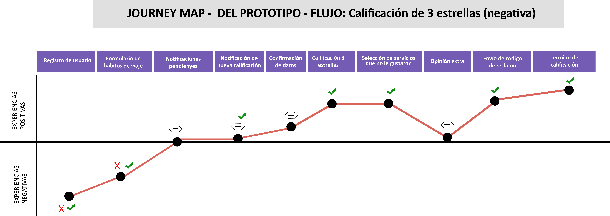.

#### 3.- **Storytelling**

- Se hizo el Storytelling de nuestro user persona primario.
- Para ello cada integrante creó su propio storytelling sobre Ana María y apartir de ello surgió uno solo, tomando las ideas de todas.
- Esta herramienta nos ayuda a mejorar e integrar mejor la experiencia de usuario con nuestro MVP.

 [STORYTELLING](https://docs.google.com/document/d/1q1ZWWkYDlnjGwTCZ3OpDM9BmJC_a23pyytVw11RARjw/edit)

### B.- **CONCEPTUALIZACIÓN**

##### 1.- **User Flows**
Luego de varios testings en clase y con personas externas nuestro Flujo Final del producto quedó así:

   [Flujo Registro](https://www.youtube.com/watch?v=FEitSazWUa4)    
   [Flujo Datos Incorrectos](https://www.youtube.com/watch?v=cZs52yjusxQ)   
   [Flujo Calificación 5 estrellas](https://www.youtube.com/watch?v=syi9jP8r9-Y)   
   [Flujo Calificación menor a 5 estrellas (sin comentario adicional)](https://www.youtube.com/watch?v=DLzqRuSkJaA)   
   [Flujo Calificación menor a 5 estrellas (con comentario adicional)](https://www.youtube.com/watch?v=ppTnacWblLo)

Esto nos sirvió para mapear el camino que nuestro user persona (Ana María) deberá seguir para satisfacer sus necesidades.

## Presentación Final MVP
[CheckBus-MVP](https://docs.google.com/presentation/d/16ZBvTogA3aGrT_pYVbx3ZkOs8tWcvS9gbSxIroWoiO0/edit#slide=id.g3361d73bc6_0_70)
